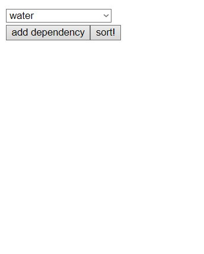
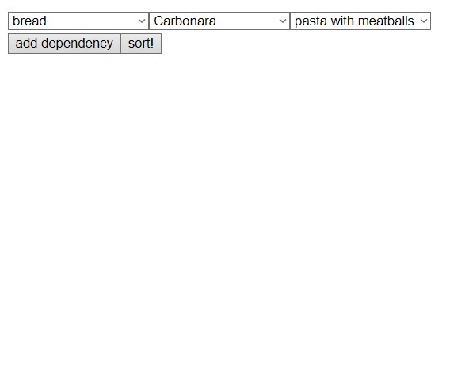
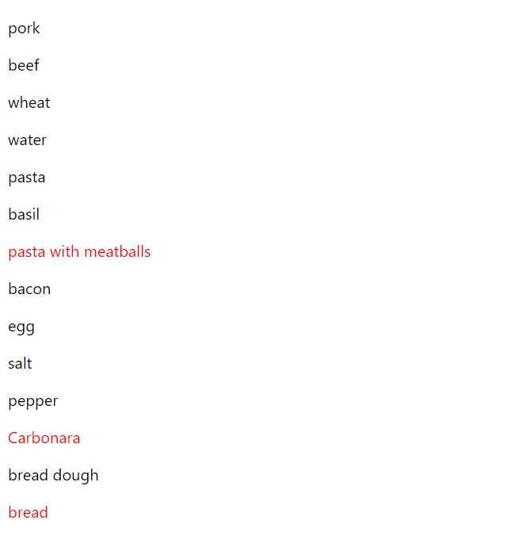

<strong>program to topologically sort relying on what items depend on</strong>
 
as demonstrations as dependencies ingredients of recipes were chosen,
you can enter whatever you want
 
<h2>Demo:</h2>
 

 

 

